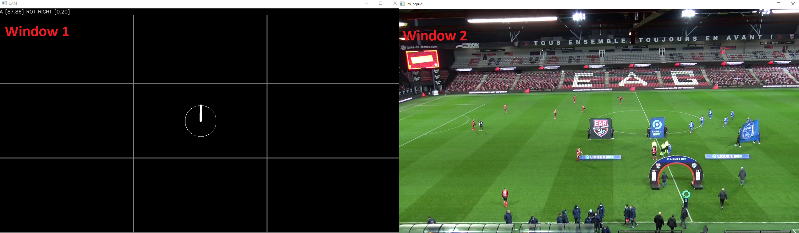
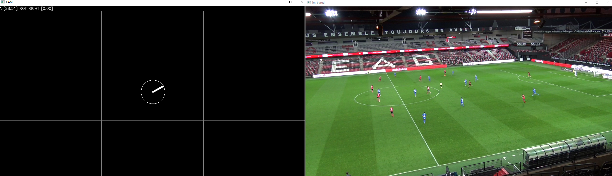

 # Camera movement

The aim is here is to able to compute the camera movement in x,y and also in angle (which is more important in our case).

## requirements


### Windows :
Works for python version > 3.6 (needed).

You need opencv-python >= 4.4.0 to make it works (no need to compile it using Cmake, you can use ```pip install opencv-python``` and ```pip install opencv-contrib-python```)

To install the requirements please ```cd``` to the folder where the project is saved and use: ```pip install -r requirements.txt```

Then drag and drop a video clip onto the camera_pos.py or use ```python camera_pos.py YourVideoFile.mp4```

### MacOS / Linux : 

Works for python version > 3.6 (needed).

You need opencv-python >= 4.4.0 to make it works (no need to compile it using Cmake, you can use ```pip3 install opencv-python``` and ```pip3 install opencv-contrib-python```)

To install the requirements please ```cd``` to the folder where the project is saved and use: ```pip3 install -r requirements.txt```

Then use ```python3 camera_pos.py YourVideoFile.mp4``` where ```YourVideoFile.mp4``` is the path to the video you want to 'read'.

## Controls

Press ```q``` to exit the program

Press ```r``` to reboot the camera position

## How it works

In a simple way, it's using opencv feature detector ( https://docs.opencv.org/3.4/d5/d51/group__features2d__main.html )to get some points.
Using this points we will be able to 'track' when the camera is moving (or not) but also the angle it's doing.

The program split the screen into multiple zones and track features here. Then it computes the average (while deleting antagonist movements) norme, cosinus and sinus of the segment computed
to link features from frame N-1 to frame N. It'll then be able to know if the camera is moving or not and which direction if filmed.

As represented on the figure bellow, you'll  have in one window the camera position (window1) and in the other (window 2) the video you're looking at.



It'll also tell you what movement it's deducing.

You can see the result of a right rotation on the figure bellow



An exemple for rotation:


An exemple for displacement:


At the end it'll print your the result of the sinus,cosinus and norme computed during your session to make you undestand what happened (and how the program is 'thinking').

## OOP mod

No plot is able here. it will only compute the camera movement (angle and position translation).

Import the class GetMotion(), instance it before the while function. Then into it use ```value = angle.does_it_move(img)``` to know if your camera is moving or not.

here is an example of a code using it :


```python

import cv2
from camera_displacement import *
vdfile = r'MyVideo.mp4'
cap = cv2.VideoCapture(vdfile)

motion = GetMotion()
while cap.isOpened():
    ret, img_bgr = cap.read()
    value = motion.does_it_move(img_bgr)
    if value == True:
        # Print angle (float)
        print(motion.A_Cam)
        # Print X position (float)
        print(motion.X_Cam)
        # Print Y position (float)
        print(motion.Y_Cam)
        # Print what movement is detected (str)
        print(motion.libmov)

    cv2.imshow('window', img_bgr)

    key = cv2.waitKey(1)
    if key == ord('q'):
        break
    angle.itteration += 1

```

working at 85 fps.

## Performances

Don't worry if the performances are (really) slow when you test it. The graphic interface takes a lot of ressources. The computed time is faster than the plot time. (for example with a Ryzen 7 3700X with no graphic chipset => from 30 fps using interface to 85 fps without). 
